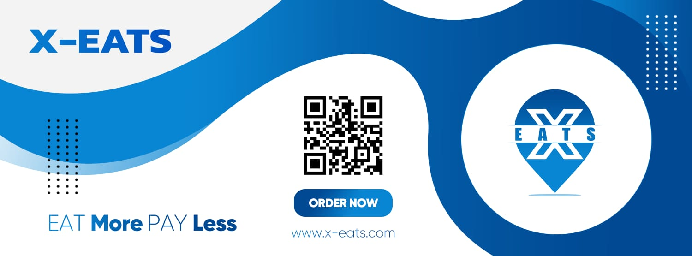
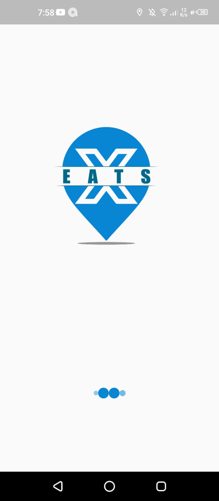
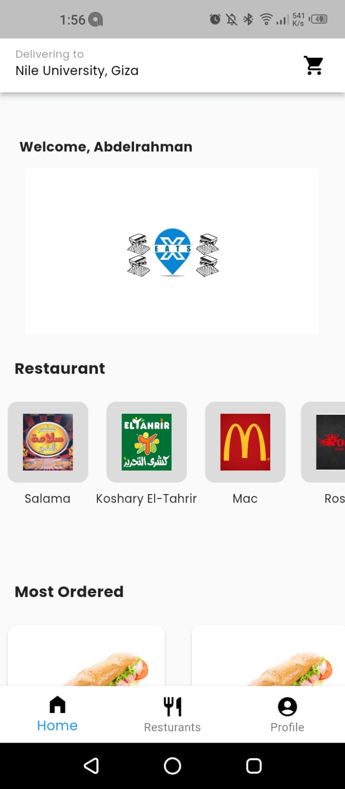
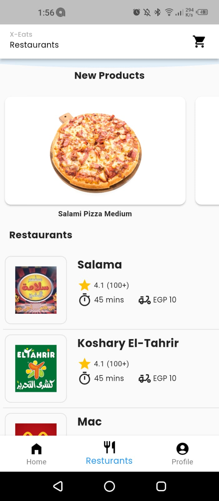
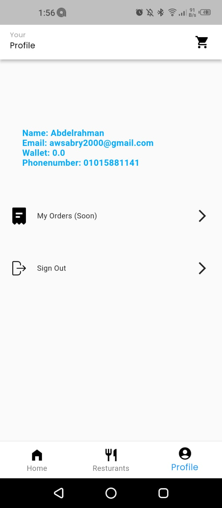
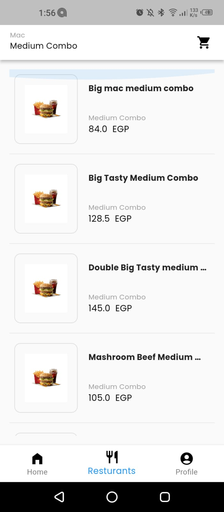
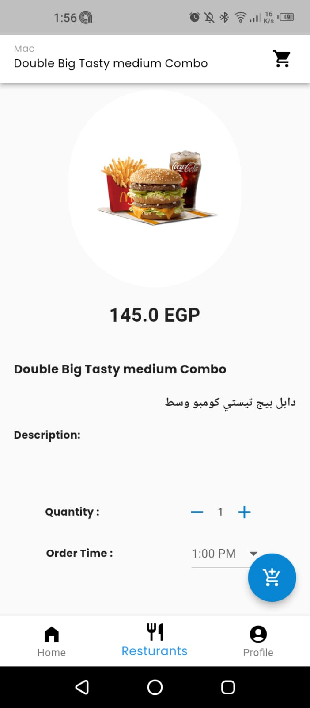
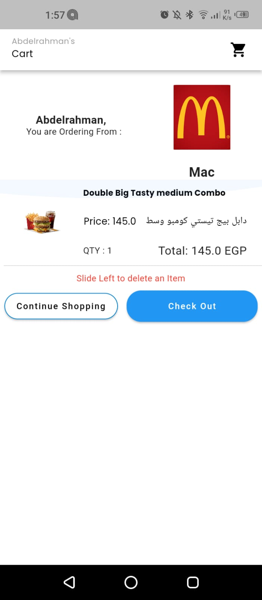
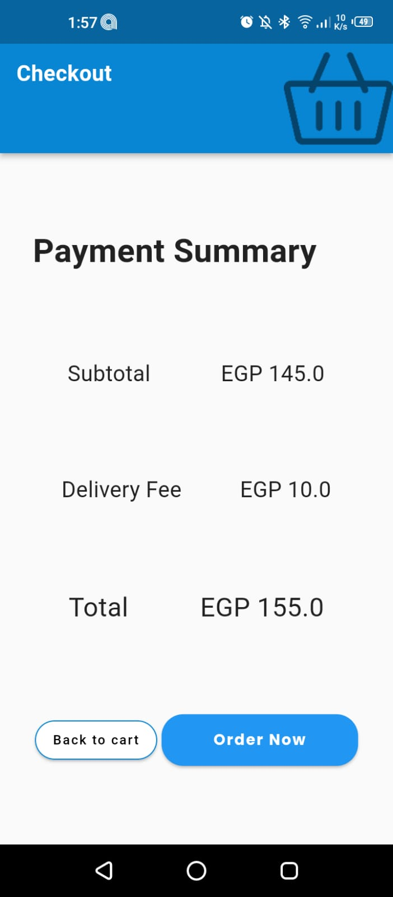

# X-Eats

## Food Distribution platform service.

    <h3> Eat More, Pay Less </h3>
    

    

## Brief OverView

X-Eats is NU students project was established in 2019, but the idea was founded by Abdelrahman Wael in Jan 2018, since that Nile University is located on a way with no source of food exist there, only delivery is used to order the food & since he was a freshman student at his university he wasn’t have the cash & the ability to order daily, so he tried to solve the problem for him & his friends, so he found the idea of X-Eats, a platform that allow the people in same location be shorted in one delivery cost from the restaurant, then the project start running into business, in 2019 every order ordered from X-Eats was costing 5 L.E in the order, whatever the order items is, & we worked for a whole one year, shortage the data of only one semester from this.. The team was 3, Abdelrahman Wael , Hassan El-Shazly, Moataz-Bellah Ahmed.

## Technicalities

This project is a starting point for a Flutter application, the website is X-Eats : [https://www.x-eats.com](http://www.x-eats.com/)

## Screenshots

    
    
    
    
    
    
    
    

